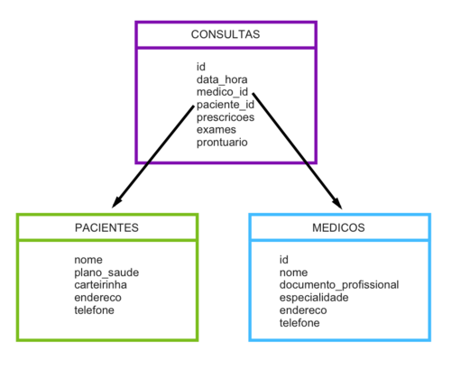

<h1 align="center">
  
</h1>

# Tema da Aula

Turma Online On18 - Todas em Tech  | Backend-end | Semana 12 | 2022 | Professora Jéssica Osko

### Instruções
Antes de começar, vamos organizar nosso setup.
* Fork esse repositório 
* Clone o fork na sua máquina (Para isso basta abrir o seu terminal e digitar `git clone url-do-seu-repositorio-forkado`)
* Entre na pasta do seu repositório (Para isso basta abrir o seu terminal e digitar `cd nome-do-seu-repositorio-forkado`)
* [Add outras intrucoes caso necessario]

### Resumo
O que veremos na aula de hoje?
* [Case Clínica Jansen's Anatomy](#tema1)
* [História do Banco de Dados](#tema2)
* [Banco de Dados Relacional(SQL)](#tema3)
* [Banco de Dados Não relacional(**NoSQL**)](#tema3)

## Conteúdo
### Case Clínica Jansen's Anatomy 

<h1 align="center">
  
</h1>

A clínica Jansen's Health costuma agendar as consultas e dados de pacientes no papel e caneta. Com o passar do tempo e com a clínica crescendo está ficando insustentável manter o que temos hoje. Toda vez que precisamos de qualquer informação do paciente ou mesmo das consultas do médico demoramos muito para achar o que precisamos. Além disso, temos dados super importantes em anotações, como prontuário e todo um histórico de pacientes. Se perdermos uma folha, podemos perder algo muito importante e sensível. Com todo esse cenário caótico, a clínica pediu nossa ajuda para organizar esses dados para melhorar o dia a dia deles e dos pacientes.


*Como resolveremos o caso da clínica!?*

Para ajudá-los a organizar os dados, precisamos antes entender a informação que eles têm para ser organizada. Essas informações são compostas de dados de consulta, dados do paciente atendido e médico que atendeu.

*O que temos desses dados?*

_Dados de Pacientes:_ Nome, Plano de Saúde, Carteirinha, Endereço, Telefone
Dados de Médicos: Nome, Documento profissional (ex: CRM), Especialidade, Telefone.

_Dados de Consultas:_ Médico, Paciente, Data e Hora, Prescrições (remédios receitados), Exames (exames prescritos), Prontuário (anotações da consulta)

Pronto, anotamos as informações utilizadas no dia a dia da clínica. 
E agora? Como vamos organizar isso?

### História do Banco de Dados

O conceito de banco de dados existia antes de existirem computadores. Alguns de vocês têm idade suficiente para se lembrar dos arquivos nos quais seus pais guardavam registros de saúde, documentos fiscais e antigas receitas de família. O primeiro banco de dados de computador foi construído na década de 1960, mas a história dos bancos de dados como os conhecemos realmente começa em 1970. 


Um banco de dados é um conjunto organizado de dados. Precisamos usar um sistema de gerenciamento de banco de dados (DPMS) para armazenar, recuperar e manipular dados no banco de dados. O DPMS é um software que interage com usuários finais, aplicativos e banco de dados.

A motivação de criar um sistema para armazenagem de dados surgiu devido ao alto custo de leitura/escrita de arquivos no [https://canaltech.com.br/produtos/O-que-e-HD/](HD).

Pensando em back-end, ele é fundamental para o funcionamento adquado de nossas aplicações, pois precisamos salvar dados dos nossos clientes.

* Motivos para utilizar um Banco de Dados
* Salvar dados da aplicação
* Deixa a aplicação escalavel
* Desempenho
* Segurança
* Confiabilidade


### Banco de Dados Relacional(SQL)

*O primeiro tipo de bancos de dados: Relacional*

Em junho de 1970, um cientista da computação da IBM chamado Edgar F. Codd publicou um artigo acadêmico intitulado  A [https://www.seas.upenn.edu/~zives/03f/cis550/codd.pdf](Relational Model of Data for Large Shared Banks). Esse artigo introduziu uma nova maneira de modelar dados. Ele elaborou uma maneira de construir um monte de tabelas com ligações cruzadas que permitiriam armazenar qualquer dado apenas uma vez. Um banco de dados com essa estrutura poderia responder a qualquer pergunta, desde que a resposta estivesse armazenada em algum lugar nele. O espaço em disco seria usado com eficiência, em um momento em que o armazenamento era caro. Este artigo lançou bancos de dados para o futuro. 

No banco de dados relacional, os dados são armazenados em tabelas, onde cada linha representa um registro que é um dado salvo e cada coluna representa um campo. Como os dados são armazenados em uma tabela, é necessário um relacionamento para identificar quais campos pertencem a quais linhas. Essa referência é chamada de chave primária, também podemos usar outras chaves como a estrangeira.

 $ SELECT from consulta 
WHERE paciente = "Ana"

Os mais conhecidos do mercado atualmente são o MySQL, PostgreSQL e o Oracle.

Para entendermos melhor o que seria um banco de dados relacional, vamos montar um esboço do nosso banco de dados relacional da nossa clínica? Primeiro vamos desenhar um modelo para nosso banco:

<h1 align="center">
  
</h1>


### Banco de Dados Não Relacional (noSQL) 

No banco de dados não-relacional, os dados são estruturados com um par de chaves/valor. Caso seja necessário fazer uma relação, utilizamos um id, que nesse caso é chamado de ObjectId, que é um identificador único para cada documento ( como se fosse um cpf). Uma vantagem do banco de dados NOSQL sobre o SQL, é que ele nos permite salvar qualquer tipo de dado e em qualquer ordem, isso é muito útil quando, por exemplo, precisamos salvar um array.


   $ db.paciente.find({ paciente: "Brizza"})


Os mais conhecidos do mercado atualmente são o **MongoDB**, Redis e o Firebase.

## 🏦 Introdução ao Mongo
Mongodb é um banco de dados NOSQL (não relacional) que surgiu em 2009 e foi desenvolvido em C + +. Ele utiliza BJSON que é bem similar com o JSON, sua linguagem de consulta/escrita é javascript, logo, por ser uma  linguagem comum ( eu amo o js ),  a sua curva de aprendizagem é pequena  para quem vem da web.

  alguns comandos com mongo

```javascript
     $ show databases;
     $ show collections;
     $ db.createCollection("alunas");
     $ db.nome_da_colecao.insert({nome: "beatriz", idade: "25"});
     $ db.nome_da_colecao.drop();
```

mais sobre: [mogodb comandos](https://www.tutorialspoint.com/mongodb/index.htm)

###  Database
Acho que já ouvimos a famosa expressão 'quebrei a base de prod' então, nossa database( base de dados ) é constituída por collections, que possui document,  geralmente num projeto, a gente possui diferentes tipos de base, para diferentes tipos de ambientes, como por exemplo: Produção, Homologação, Desenvolvimento, Testes, etc.

exemplo: criando um banco de dados

```javascript
    $ mongo
    $ use musicas;
    $ db.musicas.find();
```

### Collection e Document
Nossa `collection` é uma coleção(lista) de `document`, similar a  array, onde armazenamos, por exemplo, as nossas músicas. Nesse exemplo, uma playlist seria a `collection`, enquanto cada música seria um `document`, contendo as informações daquela música.

exmplo:

```json
[
    {   
        "_id": "ObjectId('5c8f8f8f8f8f8f8f8f8f8f8f')",
        "nome": "Duas doses de Saudade",
        "artista": "ludmila",
        "genero": "pop",
        "ano": "2016"
    },
    {   
        "_id": "ObjectId('4fsd44ffassasdasd234f56f')",
        "nome": "Amor de Que",
        "artista": "Pablo Vittar",
        "genero": "pop",
        "ano": "2016"
    }
]

```

## ⚙️ Introdução ao ORM
Um ORM é uma `técnica de desenvolvimento para nós devas`, conseguimos manipular de forma simples o nosso banco, sem ele precisamos de um especialista(DBA). Nos permite fazer como por exemplo `migrations` ( versionamento de base ) de forma simples.

### Introdução ao ORM Mongoose
O ORM Mongoose `não é o banco`, é uma ferramenta que como mencionado acima, facilita o nosso dia-a-dia enquanto devas, ele possui um conjunto recursos / funções que nos auxilia no desenvolvimento.

### `{}` Schema

Nosso mongoose utiliza a `Schema` para pôr ordem na ' bagunça ', afinal como podemos salvar qualquer coisa, de qualquer jeito, seria uma loucura não?  Para isso precisamos de um schema( espelho ) de como será salvo nosso `document`.


exemplo de schema:

```javascript
const mongoose = require('mongoose');
const PacienteSchema = monogoose.Schema({
    nome: String
});

```

### `[]` Model
Nossa `Model` ( modelo ) é a nossa representação da Collection ( coleção ), nele assim como no Array, possuímos `métodos` ( funções ) que nos permite realizar as operações do CRUD: 

| OPERAÇÃO| DESCRIÇÃO | HTTP |
| --- | --- | --- |
| C | criar/gerar | POST |
| R | ler/obter |  GET | 
| U | atualizar/substiuir | PUT/PATCH |
| D | remover/deletar | DELETE |


Exemplo de como criar uma model

```javascript
const PacienteSchema = mongoose.model('paciente', PacienteSchea);
```
Obs: Não é necessário salvar como músicas, pois o ORM cria no plural por nós, que massa né 💅

### ObjectId( )
O ObjectID é um identificador único para cada documento, ele é gerado automaticamente, podemos pensar nele como um CPF, único por dado, é por ele que consegue identificar um `Document` realizar as operações do CRUD.

```javascript
    const musicId = new moogose.Types.ObjectId();
```

## 🧑🏽‍💻 Classes | OOP (orientação a objetos) Conceitos básicos
Uma breve introdução sobre classes e objetos, para que possamos entender melhor o  nosso ORM.

###  uso da palavra reservada `new`
Quando possuímos uma classe, podemos utilizar a palavra reservada `new`  para instanciar um objeto, ou seja, construir um novo documento a partir da classe( nossa `Schema` ),  afinal, não queremos que a música da Anitta tenha altere as informações da música da Ludmila né? 🤔

```javascript
const paciente = new PacienteModel({
    nome: 'Cat'
});

```


### Métodos
Como mencionamos em aulas passadas, assim como o objeto, as classes possuiem métodos, que são funções que nos auxiliam a realizar **ações** como por exemplo: salvar um música, ou tocar uma música, no nosso dia-a-dia usamos o console`.log`, *.log("hello word")* é um método que nos permite imprimir no terminal uma mensagem de texto.

#### Métodos relação com a nossa API

| OPERAÇÃO | MONGODB | MOOGOSE | DESCRIÇÃO | HttpCode
| ---------- | -------------- | ---------------- | ----------------- | ---- |
| **C**REATE | **db**.insertOne() | new **MusicModel**() | cria um documento | 201 |
| **R**EAD | **db**.find() |  **MusicModel**.find() | ler um documento | 200 |
| **U**PDATE | **db**.updateOne() | **MusicModel**.updateOne() | atualiza um documento | 200 |
| **D**ELETE | **db**.deleteOne() | **MusicModel**.deleteOne() | deleta um documento | 200 ou 204


### Constructor
Nosso `constructor` é responsável por inicializar a nossa classe, ele recebe os parametros para criar construir a instancia da classe, como por exemplo, nossa música, é assim que nossa Schema gera a música no formato que o banco espera, no caso do mongo, um BJSON.

### Tipagem - Tipos primários
Na programação, existem tipos primários, que são responsáveis por definir o tipo de informação ( dado ) que estamos trabalhando, por exemplo um número de celular `Number`, ou um email que é texto `String`, ou até mesmo se é verdadeiro(true) ou falso(false) que é um `Boolean`, além disso, temos o `Date` que representa uma data. 

 - String -> representa *texto* -> `""`
 - Number -> representa *número*  `0`
 - Boolean -> representa `true` ou `false`
 - Date -> representa uma data, por exemplo, 1970-01-13 -> `Date`

```typescript
    class Paciente {
        nome: String
    };
```

## 📖 Referências
- https://www.gartner.com/en/information-technology/glossary/object-data-model
- https://medium.com/tkssharma/node-js-with-mongoose-odm-9697c09665df
- https://developer.mozilla.org/pt-BR/docs/Learn/Server-side/Express_Nodejs/mongoose
- https://docs.mongodb.com/
- https://docs.mongodb.com/manual/crud/
- https://docs.atlas.mongodb.com/tutorial/create-new-cluster/
- https://studio3t.com/academy/topic/mongodb-vs-sql-concepts/
- https://dzone.com/articles/sql-vs-nosql
- https://mongoosejs.com/docs/index.html

### 🎥 Videos de apoio

- [Resumo Mongodb - Codigo Fonte TV](https://www.youtube.com/watch?v=4dTI1mVLX3I)
- [nodeJs Express Mongo - Api rest full Turitorial](https://www.youtube.com/watch?v=K5QaTfE5ylk)
- [O que é banco de dados? - Curso em Video](https://www.youtube.com/watch?v=Ofktsne-utM)


***
### Exercícios 
* [Exercicio para sala](https://github.com/mflilian/repo-example/tree/main/exercicios/para-sala)
* [Exercicio para casa](https://github.com/mflilian/repo-example/tree/main/exercicios/para-casa)

### Material da aula 

### Links Úteis
- [Lorem Ipsum](https://www.lipsum.com/feed/html)
- [Lorem Ipsum](https://www.lipsum.com/feed/html)
- [Lorem Ipsum](https://www.lipsum.com/feed/html)
- [Lorem Ipsum](https://www.lipsum.com/feed/html)


<p align="center">
Desenvolvido com :purple_heart:  
</p>

